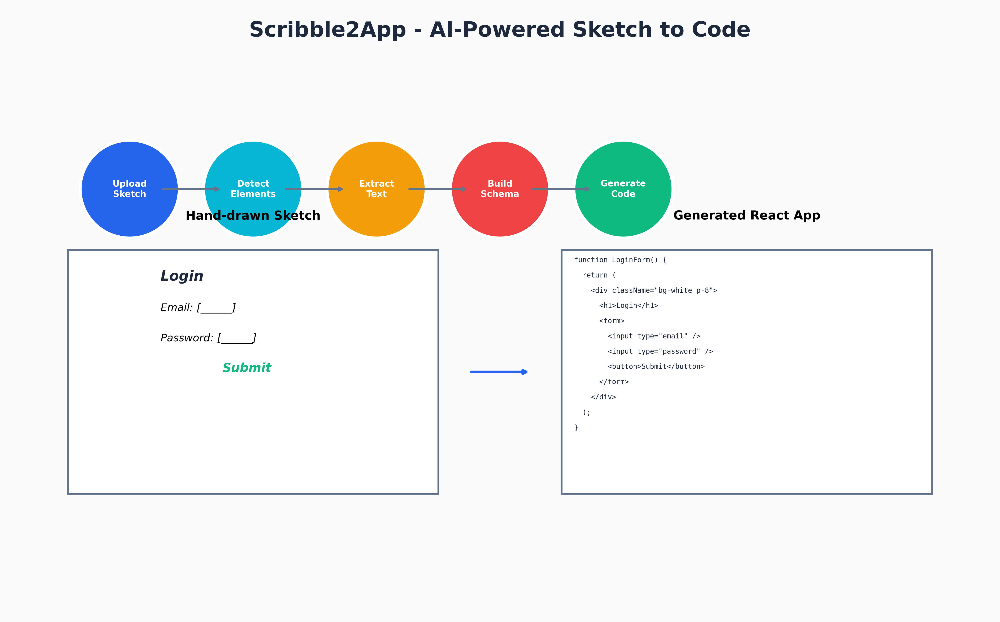

# Scribble2App

Transform hand-drawn UI sketches into production-ready React applications using advanced AI and computer vision technologies.

[](https://python.org)
[](https://streamlit.io)
[](https://reactjs.org)
[](https://tailwindcss.com)
[](LICENSE)

## Overview

Scribble2App is an intelligent application that converts hand-drawn UI sketches into fully functional React components with Tailwind CSS styling. The system combines computer vision, OCR technology, and AI-powered code generation to bridge the gap between conceptual design and implementation.



## Key Features

- **Advanced Element Detection**: Utilizes YOLOv8 and enhanced contour detection for precise UI element identification
- **Handwritten Text Recognition**: Multi-technique OCR system for extracting text from sketches
- **Intelligent Schema Building**: AI-powered analysis of element relationships and layout structure
- **React Code Generation**: GPT-4 powered generation of production-ready React components
- **Real-time Processing**: Complete pipeline execution in under 15 seconds
- **Responsive Design**: Automatic generation of mobile-friendly layouts
- **Export Ready**: One-click download of complete React projects

## Technology Stack

- **Backend**: Python 3.8+, Streamlit
- **Computer Vision**: OpenCV, YOLOv8
- **OCR**: Tesseract, Multiple preprocessing techniques
- **AI**: OpenAI GPT-4 for code generation
- **Frontend**: React 18+, Tailwind CSS
- **Deployment**: Docker support, Vercel/Netlify ready

## Quick Start

### Prerequisites

- Python 3.8 or higher
- Node.js 16+ (for running generated React applications)
- OpenAI API key

### Installation

1. **Clone the repository**
   ```bash
   git clone https://github.com/yourusername/Scribble2App.git
   cd Scribble2App
   ```

2. **Install dependencies**
   ```bash
   pip install -r requirements.txt
   ```

3. **Configure API credentials**
   ```bash
   export OPENAI_API_KEY="your-api-key-here"
   ```

4. **Launch the application**
   ```bash
   streamlit run app.py
   ```

5. **Access the interface**
   Navigate to `http://localhost:8501` in your browser

## Usage Guide

### Step 1: Upload Your Sketch

Upload a hand-drawn UI sketch in any common image format (PNG, JPG, JPEG, BMP, TIFF). The system supports images up to 10MB in size.


### Step 2: Element Detection

The AI automatically identifies UI elements including buttons, input fields, text labels, and containers. Review the detected elements with confidence scores and make manual adjustments if needed.


### Step 3: Text Extraction

OCR technology extracts handwritten text from your sketch. The system applies multiple preprocessing techniques to ensure optimal text recognition accuracy.


### Step 4: Schema Generation

AI analyzes the detected elements and their relationships to build a comprehensive UI schema, including component hierarchy and layout structure.


### Step 5: Code Generation

GPT-4 generates production-ready React components with Tailwind CSS styling, including proper component structure and responsive design.


### Step 6: Download and Deploy

Download the complete React project and deploy it to any hosting platform. The generated code includes all necessary dependencies and configuration files.


## Architecture

The application follows a modular architecture with six core components:

```
┌─────────────────┐    ┌─────────────────┐    ┌─────────────────┐
│   Upload Image  │───▶│ Detect Elements │───▶│ Extract Text    │
└─────────────────┘    └─────────────────┘    └─────────────────┘
                                                       │
┌─────────────────┐    ┌─────────────────┐    ┌─────────────────┐
│   Download App  │◀───│ Generate Code   │◀───│ Build Schema    │
└─────────────────┘    └─────────────────┘    └─────────────────┘
```

### Core Modules

- **`upload_image.py`**: Image preprocessing and validation
- **`detect_elements.py`**: YOLOv8 and contour-based element detection
- **`ocr.py`**: Multi-technique OCR for handwritten text extraction
- **`schema_builder.py`**: AI-powered UI schema generation
- **`code_gen.py`**: GPT-4 React code generation
- **`app.py`**: Streamlit web interface

## Supported UI Elements

| Element Type | Detection Method | Generated Component |
|--------------|------------------|-------------------|
| Button | YOLOv8 + Contour | `<button>` with Tailwind styling |
| Input Field | YOLOv8 + Contour | `<input>` with proper types |
| Text Label | YOLOv8 + OCR | `<label>` with semantic HTML |
| Text Area | Contour Analysis | `<textarea>` component |
| Card Container | Contour Analysis | `<div>` with shadow and border |
| Header Section | YOLOv8 + Contour | `<header>` with navigation |
| Image Placeholder | YOLOv8 | `` with responsive sizing |
| Form Container | Contour Analysis | `<form>` with validation |

## Configuration

### Environment Variables

```bash
# Required
OPENAI_API_KEY=your-openai-api-key

# Optional
MODEL_NAME=gpt-4
MAX_TOKENS=2000
DETECTION_CONFIDENCE=0.5
```

### Application Settings

- **Detection Confidence**: Adjustable threshold (0.1 - 0.9) for element detection
- **Code Generation**: Toggle TypeScript support and test generation
- **OCR Techniques**: Automatic application of multiple preprocessing methods

## Performance Metrics

- **Element Detection**: ~100ms per image
- **Text Extraction**: ~200ms per image  
- **Code Generation**: ~5-10 seconds
- **Total Pipeline**: ~10-15 seconds

## Deployment Options

### Local Development
```bash
npm install
npm start
```

### Production Deployment
```bash
npm run build
# Deploy to Vercel, Netlify, or any hosting platform
```

### Docker Deployment
```bash
docker build -t scribble2app .
docker run -p 8501:8501 scribble2app
```

## Development

### Setup Development Environment
```bash
git clone https://github.com/yourusername/Scribble2App.git
cd Scribble2App
pip install -r requirements.txt
pip install -r requirements-dev.txt
pre-commit install
```

### Running Tests
```bash
python -m pytest tests/
python test_pipeline.py
python test_ocr.py
python test_detection.py
```

### Code Quality
```bash
black .
flake8 .
pytest
```

## Contributing

We welcome contributions from the community. Please read our contributing guidelines before submitting pull requests.

### Development Workflow
1. Fork the repository
2. Create a feature branch
3. Make your changes
4. Add tests for new functionality
5. Ensure all tests pass
6. Submit a pull request

## License

This project is licensed under the MIT License. See the [LICENSE](LICENSE) file for details.

## Acknowledgments

- [YOLOv8](https://github.com/ultralytics/ultralytics) for object detection
- [Tesseract OCR](https://github.com/tesseract-ocr/tesseract) for text extraction
- [OpenAI GPT-4](https://openai.com) for code generation
- [Streamlit](https://streamlit.io) for the web interface
- [Tailwind CSS](https://tailwindcss.com) for styling

## Support

- **Bug Reports**: [GitHub Issues](https://github.com/yourusername/Scribble2App/issues)
- **Feature Requests**: [GitHub Discussions](https://github.com/yourusername/Scribble2App/discussions)
- **Documentation**: [Wiki](https://github.com/yourusername/Scribble2App/wiki)

## Roadmap

- [ ] Support for complex layouts and grids
- [ ] Integration with design systems
- [ ] Real-time collaboration features
- [ ] Mobile app version
- [ ] Advanced styling options
- [ ] Component library generation

---

<div align="center">
  <p>Built with modern AI and computer vision technologies</p>
  <p>If this project helps you, please consider giving it a star on GitHub</p>
</div> 